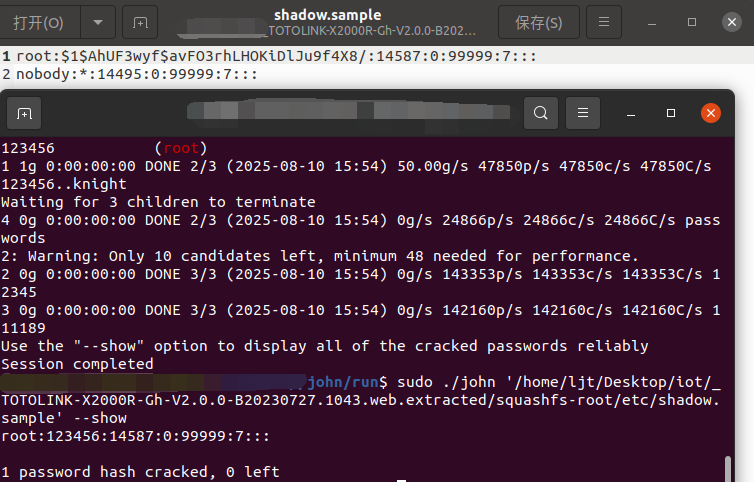

# Insecure Default Password in TOTOLINK Wi-Fi 6 Router Series Devices (X2000R-Gh-V2.0.0)
## Overview
An insecure password vulnerability was identified in TOTOLINK Wi-Fi 6 Router series devices running firmware version X2000R-Gh-V2.0.0. The root user account uses a weak password (cracked as "123456" using the John tool). This password is stored in the world-readable file /etc/shadow.sample using MD5-crypt hashing, which can be easily decrypted by tools like John and exploited. For example, it allows unauthorized root access to the device through network-accessible services or the administrative interface.

## Vulnerability Details
+ **Vulnerability Type**: Insecure Default Password
+ **Affected Product**: TOTOLINK Wi-Fi 6 Router Series Devices
+ **Affected Version**: X2000R-Gh-V2.0.0
+ **Attack Type**: Remote
+ **Attack Vector**: Unauthorized login using the default password (root:123456) via network-accessible services or the administrative interface
+ **Impact**:
    - Privilege Escalation
    - Information Disclosure
    - Potential Code Execution
+ **Affected Component**: File, user authentication mechanism (/etc/shadow.sample)
+ **CVE ID**: Pending (CVE application in progress)
+ **Discovered by**: xxricardoxkk (xxricardoxkk@gmail.com)
+ **Firmware**: [https://www.totolink.net/home/menu/detail/menu_listtpl/download/id/259/ids/36.html](https://www.totolink.net/home/menu/detail/menu_listtpl/download/id/259/ids/36.html)

## Discovery
The vulnerability was discovered by analyzing the firmware (TOTOLINK-X2000R-Gh-V2.0.0-B20230727.1043.web). The file was extracted from the squashfs-root directory, and the MD5-crypt hash of the root user's password was cracked using John, resulting in the password "123456". This weak password allows attackers to log in to the device's administrative interface or other services without additional vulnerabilities.

## Steps to Reproduce
1. Extract the firmware image TOTOLINK-X2000R-Gh-V2.0.0-B20230727.1043.web.
2. Locate the file in the extracted squashfs-root directory: squashfs-root/etc/shadow.sample.
3. Use a password-cracking tool (e.g., John) to crack the MD5-crypt hash of this user:
    - root:123456:14587:0:99999:7:::

4. Attempt to log in to the device's administrative interface or other network-accessible services using the cracked password.

## Impact
Attackers with network access to the device can:

+ Gain full administrative control by logging in with the root account (password: "123456").
+ Access sensitive configuration data, potentially exposing network details, modify device settings, or execute arbitrary code, leading to further network breaches.

